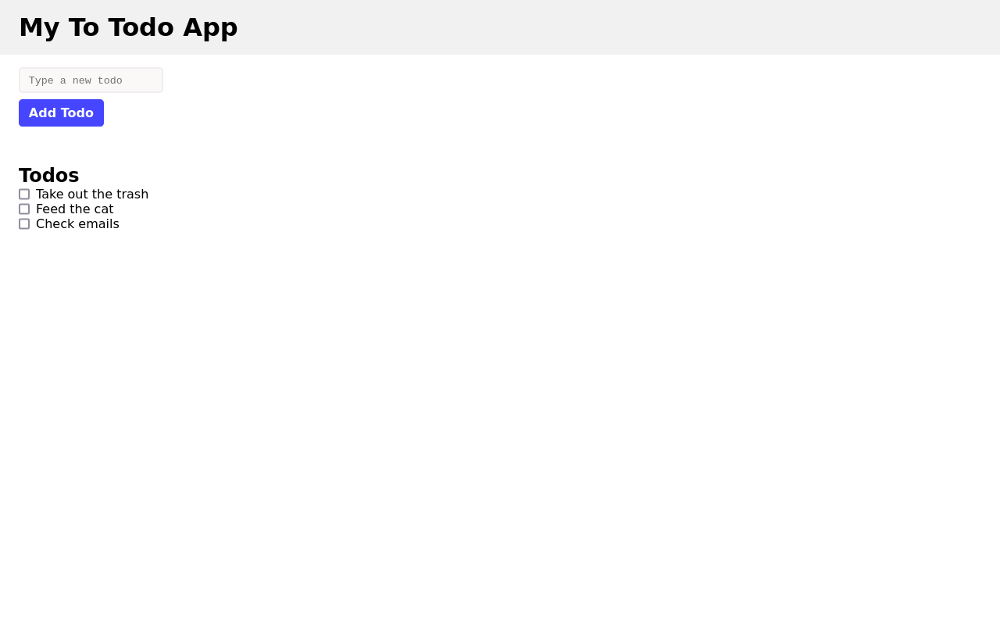

# Todo list 

A minimal todo list app, build with React.js that allows users to add tasks and mark them as complete when they are done. A project build as part of my training as junior web developer at Becode.